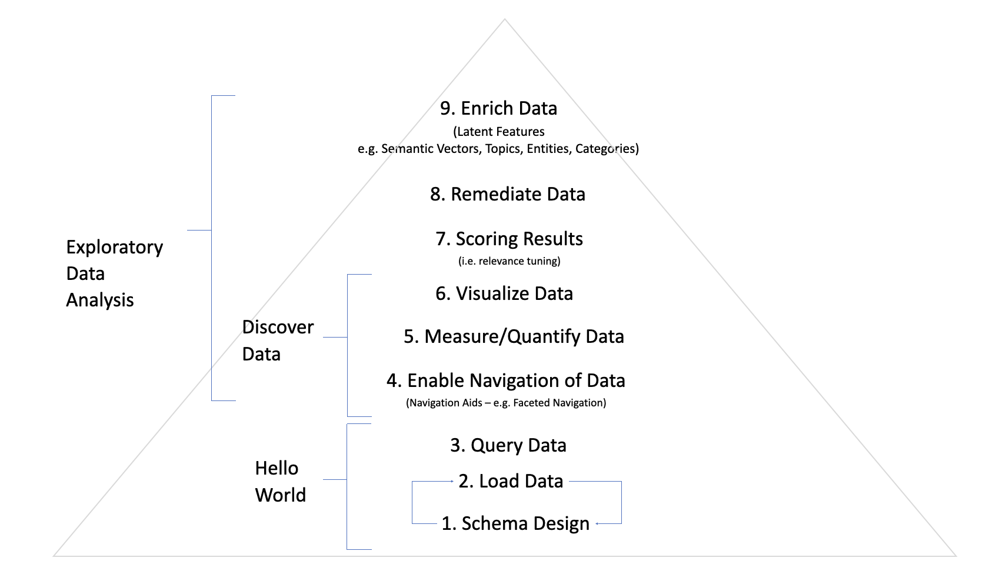

# Recipes for [Search Navigator (Solr and Vespa)](https://solr.search-navigator.org/)

*WARNING: this is a work in progress.*

This repo is an educational project, aimed at people who want to **learn search** (and neighboring activities, like data analysis, data science and other information retrieval sub-domains) **and/or Solr and Vespa**.

We will do this through a collection of [Search Navigator](https://solr.search-navigator.org/) recipes that solve specific tasks. We will arrange these recipes/tasks in a structure that follows the following hierarchy:

